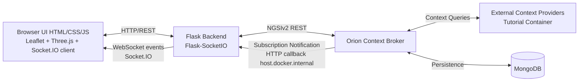

# System Architecture

## 1. Architectural Overview

The system follows a container-based, event-driven architecture centered on FIWARE Orion Context Broker (NGSIv2), with Flask as an application backend and a browser-based frontend built with HTML/CSS/JavaScript.

At a high level:
- Frontend handles rendering, user interaction, maps, and immersive 3D visualization.
- Backend orchestrates NGSIv2 operations, startup registrations/subscriptions, validation, and notification fan-out.
- Orion is the source of truth for context entities and triggers notifications.
- External context providers supply selected Store attributes (temperature, relativeHumidity, tweets).
- Docker Compose provisions and connects all runtime services.

## 2. High-Level Architecture Diagram (Textual + Mermaid)

Interpretation:
- CRUD and query traffic from UI goes through Flask to Orion.
- Orion resolves external attributes from context providers.
- Orion subscription notifications are delivered to Flask callback endpoints.
- Flask emits WebSocket events so active UI sessions update in real time.

## 3. Components and Responsibilities

## 3.1 Frontend (HTML/CSS/JavaScript)
Responsibilities:
- Render views: Home, Products, Stores, Employees, Store detail, Stores Map.
- Render entity tables, grouped inventory tables, and action links.
- Provide bilingual UI (English/Spanish) and Dark/Light mode toggle.
- Validate forms using HTML and JS validation rules.
- Render Store and global maps via Leaflet.
- Render immersive Store walkthrough via Three.js.
- Receive Socket.IO events and update existing DOM elements in all affected views.

Key design constraints:
- Prefer CSS over JavaScript whenever both can implement a visual behavior.
- Prefer DOM updates over dynamic HTML generation where feasible.

## 3.2 Backend (Flask + Flask-SocketIO)
Responsibilities:
- Expose HTTP endpoints for frontend operations.
- Translate frontend actions into NGSIv2 requests to Orion.
- Perform startup routines:
  - Register external context providers for Store temperature, relativeHumidity, tweets.
  - Register subscriptions for product price changes and low stock.
- Expose notification callback endpoints for Orion.
- Emit real-time events to browser clients through Flask-SocketIO.
- Enforce server-side validation and consistent error handling.

### Backend Architecture (Issue 1A Implementation)
The backend is structured in logical layers:

**app/__init__.py** (Flask Application Factory):
- `create_app(config_name)` function initializes Flask with configuration
- Global error handlers for application exceptions
- CORS configuration for frontend-backend communication
- OrionService instantiation and app context binding
- Blueprint registration for routes

**config/config.py** (Configuration System):
- Environment-driven configuration (no hardcoded values)
- Multi-environment support: Config (base), DevelopmentConfig, ProductionConfig, TestingConfig
- Settings: FLASK_PORT, LOG_LEVEL, CORS_ORIGINS, ORION_URL, ORION_FIWARE_SERVICE, ORION_FIWARE_SERVICEPATH, HEALTH_CHECK_TIMEOUT

**app/services/orion_service.py** (Orion NGSIv2 Client):
- Low-level HTTP client for Orion communication
- Standardized NGSIv2 headers injected into all requests
- CRUD operations: create_entity, get_entity, list_entities, update_entity_attrs, delete_entity
- Specialized operations: check_connection(), patch_entity_increment()
- Robust error handling with custom exceptions for HTTP errors
- Request/response logging for debugging

**app/routes/** (HTTP Endpoints):
- health_routes.py: Health check endpoint (GET /api/health) for monitoring
- Blueprint-based modular design for future endpoint expansion

**app/models/exceptions.py** (Error Hierarchy):
- ApplicationError (base exception)
- OrionConnectionError: Network or service unavailability
- OrionEntityNotFoundError: HTTP 404 from Orion
- OrionAPIError: HTTP 400 or 500 errors with context
- ValidationError: Input validation failures

**app/utils/logger.py** (Logging):
- setup_logging(app): Configure Flask logging pipeline
- get_logger(name): Return configured logger instance
- Structured logging with configurable severity levels

**run.py** (Entry Point):
- Application initialization and development server launch
- Environment variable loading from .env file
- Port/debug mode configuration from environment

## 3.3 Orion Context Broker (NGSIv2)
Responsibilities:
- Manage entities and attributes for Store, Employee, Product, Shelf, InventoryItem.
- Persist context data in MongoDB.
- Evaluate subscription conditions and deliver notifications.
- Resolve externally provided attributes via registered context providers.

## 3.4 External Context Providers
Responsibilities:
- Provide Store temperature and relativeHumidity values.
- Provide Store tweets.
- Serve data to Orion based on registration metadata.

Deployment note:
- Providers run in the tutorial container environment referenced by Docker Compose.

## 3.5 Docker Runtime Environment
The runtime uses Docker Compose service topology:
- Orion Context Broker container.
- Tutorial context-provider container.
- MongoDB container.
- Host-local Flask application process (or containerized Flask in later evolution).

Important callback rule:
- Orion runs in a container; localhost inside Orion points to its own container.
- Subscription callback URL must use host.docker.internal to reach the host machine backend.

## 4. Communication Architecture

## 4.1 REST/HTTP Communication (NGSIv2)
Primary channel:
- Backend to Orion: NGSIv2 REST operations for CRUD, queries, patch updates, registrations, subscriptions.

Examples:
- Entity CRUD for Product, Store, Employee, Shelf, InventoryItem.
- Buy-one-unit inventory patch:
  PATCH /v2/entities/<inventoryitem_id>/attrs with increment semantics.

## 4.2 WebSocket Communication (Socket.IO)
Primary channel:
- Backend to Frontend: real-time notifications for relevant business events.

Events include:
- Product price change.
- Low stock warning.

Expected behavior:
- Frontend updates all active views where changed entities are displayed.

## 5. Data Flows

## 5.1 Entity Update Flow (User-Initiated)
1. User performs CRUD action in frontend.
2. Frontend sends request to Flask backend.
3. Backend validates and maps request to Orion NGSIv2 call.
4. Orion updates entity state in MongoDB-backed context.
5. Backend returns operation result to frontend.
6. Frontend refreshes or patches the impacted UI region.

## 5.2 External Context Resolution Flow
1. Backend registers external providers at startup.
2. Orion stores registration metadata.
3. When requested, Orion obtains temperature/relativeHumidity/tweets from provider endpoints.
4. Backend/frontend consume enriched Store context.

## 5.3 Subscription Notification Flow
1. Backend registers subscriptions in Orion.
2. Condition occurs in Orion (price change or low stock).
3. Orion POSTs notification payload to Flask callback endpoint using host.docker.internal.
4. Flask processes payload and emits Socket.IO event.
5. Connected browsers receive event and update affected UI state:
   - Store notifications panel update.
   - Product price reflected in all relevant views.

## 5.4 Store Purchase Flow (Buy One Unit)
1. User clicks Buy one unit in Store detail InventoryItem row.
2. Frontend requests backend purchase endpoint.
3. Backend sends Orion patch increment request:
   - shelfCount decrement by 1
   - stockCount decrement by 1
4. Orion applies atomic attribute updates.
5. Backend returns updated state and frontend refreshes impacted values.
6. If low stock threshold is crossed, Orion subscription notification triggers standard notification flow.

## 6. View-to-Component Mapping

- Home:
  - Frontend Mermaid render of entity UML.
- Products view:
  - Product table CRUD, color/size display.
- Product detail:
  - Inventory grouped by Store and Shelf; constrained Shelf selection.
- Stores view:
  - Store table with environmental metrics and CRUD.
- Store detail:
  - Leaflet map, Three.js immersive shelf/product view, grouped inventory by Shelf, purchase action, tweets, notifications panel.
- Employees view:
  - Employee table with category/skills and CSS hover photo transition.
- Stores Map:
  - Leaflet map with Store imagery, hover cards, and click-to-detail navigation.

## 7. Architectural Constraints and Quality Decisions

- Strict source of truth: assignment requirements govern scope.
- Real-time updates use event propagation pattern (Orion -> Flask -> Socket.IO clients).
- UI consistency uses shared rendering patterns for grouped tables and action links.
- Visual behavior is primarily CSS-driven, reserving JS for state and data flow.
- Dockerized infrastructure isolates broker/provider/persistence concerns.

## 8. Operational Considerations

Startup sequence requirements:
1. Start infrastructure services (MongoDB, Orion, tutorial provider).
2. Start Flask backend.
3. Execute backend startup tasks:
   - Register context providers.
   - Register subscriptions.
4. Open frontend UI.

Failure handling expectations:
- Retry-safe registration/subscription bootstrapping.
- Graceful UI degradation if external provider data is temporarily unavailable.
- Notification endpoint observability via backend logs for troubleshooting.

## 9. Documentation and Workflow Alignment

For every completed implementation issue under GitHub Flow:
- Update PRD.md, architecture.md, and data_model.md.
- Keep architecture diagrams and flow descriptions synchronized with actual behavior.
- Ensure README and deployment instructions remain aligned with container topology and callback URL rules.

## 10. GitHub Flow Development Workflow

This project adopts GitHub Flow as the mandatory development workflow.

1. Issue creation:
  - Define an implementation issue in the remote GitHub repository from an agreed plan.
  - The issue includes scope, acceptance criteria, and affected artifacts.
2. Branching:
  - Create a dedicated branch from `main` for the issue implementation.
  - Branch naming should map clearly to the issue scope.
3. Commit and push:
  - Implement changes in small, traceable commits in the issue branch.
  - Push the branch to origin to back up progress and enable review.
4. Merge or pull request:
  - If repository permissions allow, merge the issue branch into `main` to close the issue.
  - If direct merge is not allowed, open a pull request and have the repository owner review and merge it.
5. Post-issue documentation update:
  - After merge, update `PRD.md`, `architecture.md`, and `data_model.md` to reflect the implemented behavior.
  - Optional governance rules can be codified in `AGENTS.md`.