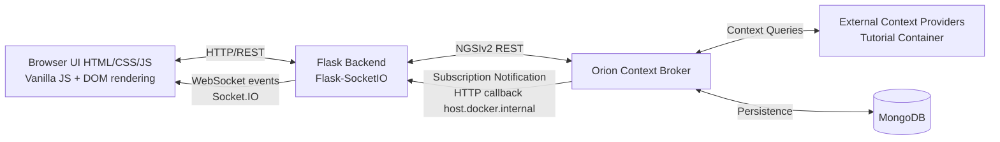
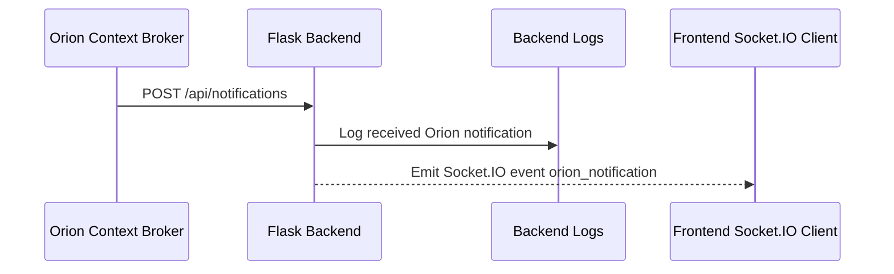

# System Architecture

## 1. Architectural Overview

The system follows a container-based architecture centered on FIWARE Orion Context Broker (NGSIv2), with Flask as backend and a browser frontend built with HTML/CSS/JavaScript.

At a high level:
- Frontend handles rendering and user interaction using vanilla JavaScript and direct DOM updates.
- Backend orchestrates NGSIv2 operations, startup subscriptions, validation, and notification fan-out.
- Orion is the source of truth for context entities and triggers notifications.
- External context providers supply selected Store attributes (temperature, relativeHumidity, tweets) through Orion.
- Docker Compose provisions and connects all runtime services.

## 2. High-Level Architecture Diagram (Textual + Mermaid)

Interpretation:
- CRUD and query traffic from UI goes through Flask to Orion.
- Orion resolves external attributes from context providers.
- Orion subscription notifications are delivered to Flask callback endpoints.
- Flask emits WebSocket events so active UI sessions update in real time.

## 3. Components and Responsibilities

## 3.1 Frontend (HTML/CSS/JavaScript)
Responsibilities:
- Render views: Home, Products, Stores, and Employees.
- Render entity tables and Store detail grouped inventory view.
- Execute CRUD actions through fetch-based REST calls to backend endpoints.
- Render Store detail using DOM logic with hierarchy Store -> Shelves -> InventoryItems.
- Execute Store detail actions (add Shelf, add InventoryItem, buy product).

Key design constraints:
- No frontend framework.
- Prefer simple DOM updates and small rendering helpers.

## 3.2 Backend (Flask + Flask-SocketIO)
Responsibilities:
- Expose HTTP endpoints for frontend operations.
- Translate frontend actions into NGSIv2 requests to Orion.
- Perform startup routines:
  - Register external context providers for Store temperature, relativeHumidity, tweets.
  - Register subscriptions for product price changes and low stock.
- Expose notification callback endpoints for Orion.
- Emit real-time events to browser clients through Flask-SocketIO.
- Enforce server-side validation and consistent error handling.

### Backend Architecture (Issue 1A + Issue 1B + Issue 1C Implementation)
The backend is structured in logical layers:

**app/__init__.py** (Flask Application Factory):
- `create_app(config_name)` function initializes Flask with configuration
- Global error handlers for application exceptions
- CORS configuration for frontend-backend communication
- OrionService instantiation and app context binding
- Blueprint registration for routes

**config/config.py** (Configuration System):
- Environment-driven configuration (no hardcoded values)
- Multi-environment support: Config (base), DevelopmentConfig, ProductionConfig, TestingConfig
- Settings: FLASK_PORT, LOG_LEVEL, CORS_ORIGINS, ORION_URL, ORION_FIWARE_SERVICE, ORION_FIWARE_SERVICEPATH, HEALTH_CHECK_TIMEOUT

**app/services/orion_service.py** (Orion NGSIv2 Client):
- Low-level HTTP client for Orion communication
- Standardized NGSIv2 headers injected into all requests
- CRUD operations: create_entity, get_entity, list_entities, update_entity_attrs, delete_entity
- Specialized operations: check_connection(), patch_entity_increment()
- Robust error handling with custom exceptions for HTTP errors
- Request/response logging for debugging

**app/services/product_service.py** (Product Service Layer):
- Handles Product required-field validation (presence only)
- Applies Product ID strategy (payload id, otherwise UUID fallback)
- Maps Product payloads to/from NGSIv2 format
- Delegates Orion communication to OrionService

**app/services/store_service.py** (Store Service Layer):
- Handles Store required-field validation (presence only)
- Applies Store ID strategy (payload id, otherwise UUID fallback)
- Maps Store payloads to/from NGSIv2 format
- Delegates Orion communication to OrionService

**app/services/employee_service.py** (Employee Service Layer):
- Handles Employee CRUD operations
- Validates required fields, basic types, and simple formats (email, dateOfContract)
- Validates skills enum values
- Validates refStore existence in Orion
- Applies ID strategy (payload id, otherwise UUID fallback)

**app/services/shelf_service.py** (Shelf Service Layer):
- Handles Shelf CRUD operations
- Validates required fields and basic types
- Validates numeric constraint (maxCapacity > 0)
- Validates optional location shape (geo point object)
- Validates refStore existence in Orion
- Applies ID strategy (payload id, otherwise UUID fallback)

**app/services/inventory_item_service.py** (InventoryItem Service Layer):
- Handles InventoryItem CRUD operations
- Validates required fields and basic types
- Validates numeric constraints (shelfCount >= 0, stockCount >= 0)
- Validates refStore, refShelf, and refProduct existence in Orion
- Applies ID strategy (payload id, otherwise UUID fallback)

**app/services/subscription_service.py** (Subscription Service):
- Builds Orion subscription payloads for Product price changes and InventoryItem low stock.
- Registers subscriptions at startup while avoiding duplicate creation.

**app/services/context_provider_service.py** (Context Provider Registration Service):
- Builds Orion registration payloads for external Store attributes.
- Registers providers for `temperature`, `relativeHumidity`, and `tweets` at startup.
- Uses isolated try/except handling per registration so startup never crashes on individual failures.

**app/services/notification_event_service.py** (Notification Event Service):
- Parses Orion notification payloads.
- Emits Socket.IO events for supported event types.

**app/routes/** (HTTP Endpoints):
- health_routes.py: Health check endpoint (GET /api/health) for monitoring
- product_routes.py: Product CRUD endpoints (/api/products, /api/products/<id>)
- store_routes.py: Store CRUD endpoints (/api/stores, /api/stores/<id>)
- employee_routes.py: Employee CRUD endpoints (/api/employees, /api/employees/<id>)
- shelf_routes.py: Shelf CRUD endpoints (/api/shelves, /api/shelves/<id>)
- inventory_item_routes.py: InventoryItem CRUD endpoints (/api/inventory-items, /api/inventory-items/<id>)
- notification_routes.py: Orion callback endpoint (/api/notifications)
- registration_routes.py: Orion registrations proxy endpoint (GET /api/registrations)
- Blueprint-based modular design for future endpoint expansion

Issue 1B/1C request processing flow:
- Route -> Service -> OrionService
- Routes handle request parsing and response formatting
- Services handle validation, ID handling, mapping, and orchestration
- OrionService remains low-level only (HTTP/NGSIv2 transport and broker error handling)

Validation scope in implemented backend services:
- Required fields
- Basic type checks
- Simple format checks (email, datetime)
- Numeric constraints for capacity/count fields
- Relationship checks limited to referenced entity existence in Orion
- No deep cross-entity consistency rules in Issue 1C

**app/models/exceptions.py** (Error Hierarchy):
- ApplicationError (base exception)
- OrionConnectionError: Network or service unavailability
- OrionEntityNotFoundError: HTTP 404 from Orion
- OrionAPIError: HTTP 400 or 500 errors with context
- ValidationError: Input validation failures

**app/utils/logger.py** (Logging):
- setup_logging(app): Configure Flask logging pipeline
- get_logger(name): Return configured logger instance
- Structured logging with configurable severity levels

**run.py** (Entry Point):
- Application initialization and development server launch
- Environment variable loading from .env file
- Port/debug mode configuration from environment

## 3.3 Orion Context Broker (NGSIv2)
Responsibilities:
- Manage entities and attributes for Store, Employee, Product, Shelf, InventoryItem.
- Persist context data in MongoDB.
- Evaluate subscription conditions and deliver notifications.
- Resolve externally provided attributes via registered context providers.

## 3.4 External Context Providers
Responsibilities:
- Provide Store temperature and relativeHumidity values.
- Provide Store tweets.
- Serve data to Orion based on registration metadata.

Deployment note:
- Providers run in the tutorial container environment referenced by Docker Compose.

## 3.5 Docker Runtime Environment
The runtime uses Docker Compose service topology:
- Orion Context Broker container.
- Tutorial context-provider container.
- MongoDB container.
- Host-local Flask application process (or containerized Flask in later evolution).

Important callback rule:
- Orion runs in a container; localhost inside Orion points to its own container.
- Subscription callback URL must use host.docker.internal to reach the host machine backend.

Linux Docker networking note:
- In this project, `host.docker.internal` was not reliable on Linux for Orion callbacks.
- The working host callback address is the Docker bridge gateway `172.17.0.1`, so Orion posts notifications to `http://172.17.0.1:5000/api/notifications`.

## 4. Communication Architecture

## 4.1 REST/HTTP Communication (NGSIv2)
Primary channel:
- Backend to Orion: NGSIv2 REST operations for CRUD, queries, patch updates, registrations, subscriptions.

Examples:
- Entity CRUD for Product, Store, Employee, Shelf, InventoryItem.
- Buy-one-unit inventory patch:
  PATCH /v2/entities/<inventoryitem_id>/attrs with increment semantics.

Implemented backend endpoint matrix:
- /api/products and /api/products/<id>
- /api/stores and /api/stores/<id>
- /api/employees and /api/employees/<id>
- /api/shelves and /api/shelves/<id>
- /api/inventory-items and /api/inventory-items/<id>

## 4.2 WebSocket Communication (Socket.IO)
Primary channel:
- Backend to Frontend: real-time notifications for relevant business events.

Current status:
- Backend Socket.IO emission is implemented.
- Frontend Socket.IO client consumption is pending.

Update:
- Frontend Socket.IO client consumption is now implemented.
- Real-time notification delivery is active from Orion to backend to connected browsers.

## Orion -> Backend -> Frontend Real-Time Flow

Full real-time pipeline:
1. Orion detects subscribed entity changes (`Product.price` or low `InventoryItem.stockCount`).
2. Orion sends HTTP POST callback to backend `/api/notifications`.
3. Backend receives and processes the payload.
4. Backend emits Socket.IO event `orion_notification`.
5. Frontend receives the event and updates the notifications UI.

Text diagram:

Orion -> Flask API -> Socket.IO -> Browser UI

Implementation details:
- Backend real-time channel is implemented with Flask-SocketIO.
- Event name used for notification forwarding is `orion_notification`.
- Frontend Socket.IO client uses compatible `4.7.x` version.

## 5. Data Flows

## 5.1 Entity Update Flow (User-Initiated)
1. User performs CRUD action in frontend.
2. Frontend sends request to Flask backend.
3. Backend validates and maps request to Orion NGSIv2 call.
4. Orion updates entity state in MongoDB-backed context.
5. Backend returns operation result to frontend.
6. Frontend refreshes or patches the impacted UI region.

## 5.2 External Context Resolution Flow
1. Backend registers external providers at startup.
2. Orion stores registration metadata.
3. When requested, Orion obtains temperature/relativeHumidity/tweets from provider endpoints.
4. Backend/frontend consume enriched Store context.

## 5.3 Subscription Notification Flow
1. Backend registers subscriptions in Orion.
2. Condition occurs in Orion (price change or low stock).
3. Orion POSTs notification payload to the Flask callback endpoint at `http://172.17.0.1:5000/api/notifications`.
4. Flask receives the notification, logs it, and forwards it to the notification event service when applicable.
5. Backend emits `orion_notification` through Flask-SocketIO.
6. Connected browsers receive the event in real time and update the notification panel.

### 5.4 Subscription Flow Diagram

The diagram highlights the current implemented production flow.

## 5.4 Store Purchase Flow (Buy One Unit)
1. User clicks Buy product in a Store detail InventoryItem row.
2. Frontend reads current `shelfCount` and `stockCount` from the selected InventoryItem entity.
3. Frontend calls `PATCH /api/inventory-items/<id>` with both values decremented by 1.
4. Backend validates and forwards the update through OrionService.
5. Frontend reloads Store detail data using the existing fetch/render cycle.

## 6. View-to-Component Mapping

- Home:
  - Static dashboard entry view.
- Products view:
  - Product table CRUD, including color/size/price columns.
- Stores view:
  - Store table CRUD and Store detail section for inventory grouping.
- Store detail (inside Stores view):
  - Inventory grouped by Shelf.
  - Products rendered per Shelf with image, name, price, size, color.
  - shelfCount and stockCount shown per InventoryItem.
  - Shelf capacity progress bar.
  - Add Shelf, Add InventoryItem, and Buy product actions.
- Employees view:
  - Employee table CRUD with category and skills.

## 7. Architectural Constraints and Quality Decisions

- Strict source of truth: assignment requirements govern scope.
- Real-time updates use event propagation pattern (Orion -> Flask -> Socket.IO clients).
- UI consistency uses shared rendering patterns for grouped tables and action links.
- Visual behavior is primarily CSS-driven, reserving JS for state and data flow.
- Dockerized infrastructure isolates broker/provider/persistence concerns.

## 8. Operational Considerations

Startup sequence requirements:
1. Start infrastructure services (MongoDB, Orion, tutorial provider).
2. Start Flask backend.
3. Execute backend startup tasks:
  - Register subscriptions.
  - Register external context providers (temperature, relativeHumidity, tweets).
4. Open frontend UI.

## 9. Project Structure and Deployment Baseline (Issue #16)

The real implemented repository/deployment baseline includes:

- Root governance and onboarding docs: `AGENTS.md` and root `README.md`.
- Docker Compose application services:
  - `backend`: Flask + Flask-SocketIO containerized runtime exposed at `localhost:5000`.
  - `frontend`: static nginx service exposed at `localhost:3000`.
- Existing FIWARE infra services remain active:
  - `orion-v2`
  - `mongo-db`
  - `tutorial`

Port allocation in current baseline:

- Frontend app: 3000
- Backend API: 5000
- Orion: 1026
- Tutorial app: 3002
- Tutorial dummy devices: 3001

This issue modifies structure and deployment wiring only; it does not change domain/business logic.

Failure handling expectations:
- Retry-safe registration/subscription bootstrapping.
- Graceful UI degradation if external provider data is temporarily unavailable.
- Notification endpoint observability via backend logs for troubleshooting.
- Orion startup failures do not crash the Flask app; the backend continues running even if subscription registration cannot complete.

## 9. Documentation and Workflow Alignment

For every completed implementation issue under GitHub Flow:
- Update PRD.md, architecture.md, and data_model.md.
- Keep architecture diagrams and flow descriptions synchronized with actual behavior.
- Ensure README and deployment instructions remain aligned with container topology and callback URL rules.

## 10. GitHub Flow Development Workflow

This project adopts GitHub Flow as the mandatory development workflow.

1. Issue creation:
  - Define an implementation issue in the remote GitHub repository from an agreed plan.
  - The issue includes scope, acceptance criteria, and affected artifacts.
2. Branching:
  - Create a dedicated branch from `main` for the issue implementation.
  - Branch naming should map clearly to the issue scope.
3. Commit and push:
  - Implement changes in small, traceable commits in the issue branch.
  - Push the branch to origin to back up progress and enable review.
4. Merge or pull request:
  - If repository permissions allow, merge the issue branch into `main` to close the issue.
  - If direct merge is not allowed, open a pull request and have the repository owner review and merge it.
5. Post-issue documentation update:
  - After merge, update `PRD.md`, `architecture.md`, and `data_model.md` to reflect the implemented behavior.
  - Optional governance rules can be codified in `AGENTS.md`.