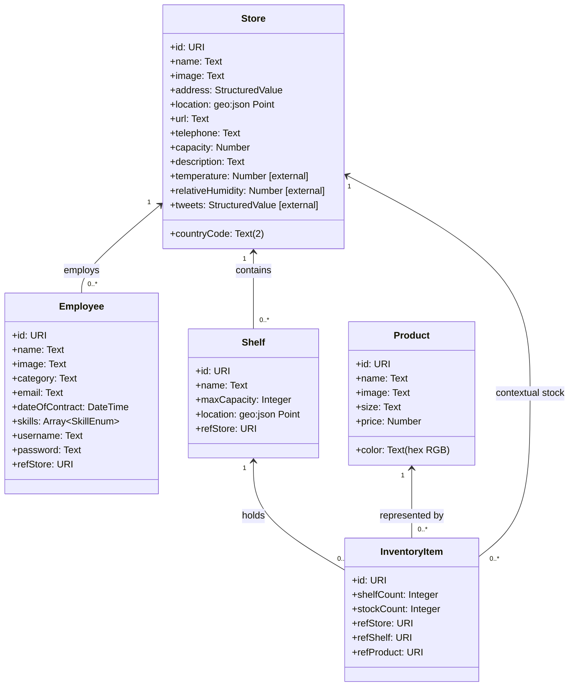

# Data Model Specification

## 1. Scope and Modeling Approach

This document defines the extended NGSIv2 entity model for the FIWARE enhanced application.

Entities in scope:
- Store
- Employee
- Product
- Shelf
- InventoryItem

The model includes assignment-mandated attributes and relationships, while preserving core operational attributes required by list/detail views and inventory workflows.

## 2. Entity Definitions

## 2.1 Store

### Purpose
Represents a physical store/warehouse where products are stored and sold.

### Attributes
Mandatory extension attributes from assignment:
- url: Text (store website URL)
- telephone: Text
- countryCode: Text (exactly 2 characters)
- capacity: Number (cubic meters)
- description: Text (long-form)
- temperature: Number (provided by external context provider)
- relativeHumidity: Number (provided by external context provider)
- tweets: StructuredValue (provided by external context provider)

Operational/base attributes needed by required views:
- name: Text
- image: Text (image URL/path)
- address: StructuredValue (postal address)
- location: geo:json Point (latitude/longitude)

Issue 1B backend CRUD fields for Store:
- name
- image
- address
- location
- url
- telephone
- countryCode
- capacity
- description

## 2.2 Employee

### Purpose
Represents an employee assigned to exactly one Store.

### Attributes
Mandatory extension attributes from assignment:
- email: Text (email format)
- dateOfContract: DateTime
- skills: Array<Text> constrained to:
  - MachineryDriving
  - WritingReports
  - CustomerRelationships
- username: Text
- password: Text

Operational/base attributes needed by required views:
- name: Text
- image: Text (photo URL/path)
- category: Text (used for iconized display)

Relationship attribute:
- refStore: Relationship -> Store (exactly one Store per Employee)

## 2.3 Product

### Purpose
Represents a product type stored on shelves and sold from inventory.

### Attributes
Mandatory extension attribute from assignment:
- color: Text (RGB hexadecimal format, for example #FFAA00)

Operational/base attributes needed by required views and subscriptions:
- name: Text
- image: Text (image URL/path)
- size: Text
- price: Number

Issue 1B backend CRUD fields for Product:
- name
- image
- size
- price
- color

## 2.6 Issue 1B Validation and ID Policy (Implemented)

For Product and Store in Issue 1B:
- Validation scope is minimal: required field presence only.
- No advanced validation is applied in this phase (format, enums, relationships are deferred).

Entity ID strategy in create operations:
- Use payload `id` when provided.
- Otherwise generate a UUID.
- The resulting `id` is included in the NGSI entity sent to Orion.

## 2.4 Shelf

### Purpose
Represents a shelf inside a Store with finite capacity.

### Attributes
- name: Text
- maxCapacity: Integer (maximum units shelf can hold)
- location: geo:json Point (optional positional metadata inside/outside store context)

Relationship attribute:
- refStore: Relationship -> Store (each Shelf belongs to one Store)

Derived/visual value used in UI:
- fillLevelPercent: Computed value for progress bar coloring (derived from shelf inventory totals vs maxCapacity)

## 2.5 InventoryItem

### Purpose
Represents product inventory counts at Store/Shelf granularity.

### Attributes
- shelfCount: Integer (units for Product on a specific Shelf)
- stockCount: Integer (total units for Product in the Store context represented by this row)

Relationship attributes:
- refProduct: Relationship -> Product
- refShelf: Relationship -> Shelf
- refStore: Relationship -> Store

Operational rule:
- Buy-one-unit operation decrements shelfCount and stockCount by 1 using Orion patch increment semantics.

## 3. Relationship Model

Mandatory relationship chain:
1. Employee -> Store
   - Cardinality: many Employees to one Store.
   - Constraint: each Employee works in one and only one Store.

2. Store -> Shelf
   - Cardinality: one Store to many Shelves.

3. Shelf -> InventoryItem
   - Cardinality: one Shelf to many InventoryItems.

4. Product -> InventoryItem
   - Cardinality: one Product to many InventoryItems.

Additional contextual relation used in data access:
- InventoryItem -> Store (denormalized access path for grouped queries by Store).

## 4. Business Constraints

1. countryCode must be exactly two characters.
2. skills must contain only allowed enum values.
3. Product color must be stored as RGB hexadecimal text.
4. An Employee must always reference one valid Store.
5. A Shelf must always reference one valid Store.
6. An InventoryItem must reference valid Product, Shelf, and Store entities.
7. In Product detail view, adding InventoryItem is limited to Shelves in the selected Store that do not already contain that Product.
8. In Store detail view, adding InventoryItem to Shelf is limited to Products not already present in that Shelf.

Issue 1C backend enforcement scope for constraints 4-6:
- Relationship validation checks only that referenced entities exist in Orion.
- Cross-entity consistency rules are not enforced in this issue.

## 5. External Context Attribution Rules

Store attributes temperature, relativeHumidity, and tweets are externally provided context attributes:
- Registered in Orion at application startup.
- Resolved from tutorial external context providers.
- Treated as standard Store attributes at query/render time.
- `tweets` shall be modeled as `StructuredValue` to preserve provider payload structure.

## 6. NGSIv2-Oriented Attribute Typing Guidance

Recommended NGSIv2 attribute typing:
- Text-like values: type Text
- Numeric counts/capacity/metrics: type Integer or Number as appropriate
- Dates: type DateTime
- Enumerated lists: type StructuredValue or Array representation
- tweets payload: type StructuredValue
- Geospatial coordinates: type geo:json
- Entity references: Relationship-style URI fields (for NGSIv2 often represented as Text URI fields with ref naming convention)

## 7. Mermaid UML Entity Diagram

The Mermaid UML diagram defined below shall be rendered in the Home view of the application.

## 8. View Traceability Matrix

- Products list view requires: Product.image, Product.name, Product.color, Product.size.
- Stores list view requires: Store.image, Store.name, Store.countryCode, Store.temperature, Store.relativeHumidity.
- Employees list view requires: Employee.image, Employee.name, Employee.category, Employee.skills.
- Product detail grouping requires: InventoryItem.stockCount by Store and InventoryItem.shelfCount by Shelf.
- Store detail grouped table requires: Shelf.name, Shelf.maxCapacity, Product(image/name/price/size/color), InventoryItem.stockCount, InventoryItem.shelfCount.
- Store map/detail requires: Store.location and Store.image.

## 9. Data Initialization Targets (Assignment-Aligned)

Initial load script must include at least:
- 4 Employees
- 4 Stores
- 4 Shelves per Store
- 10 Products
- Enough InventoryItems to guarantee at least 4 Products per Shelf

This initialization baseline ensures all mandatory UI views and grouping behavior.

## 10. Implementation Status

### 10.1 Backend Preparation for Data Model (Issue 1A)

Issue 1A establishes the foundational backend infrastructure required to support the entities defined in this data model:

- **OrionService** is ready to perform CRUD operations on Store, Employee, Product, Shelf, and InventoryItem entities
- All entities can be queried, created, updated, and deleted via NGSIv2 /v2/entities endpoints
- Proper NGSIv2 headers (Fiware-Service, Fiware-ServicePath) are injected into all requests
- Error handling and logging are in place for Orion communication failures

**What is NOT yet implemented**:

- **Entity Services**: Business logic services for Product, Store, Employee, Shelf, InventoryItem (Issue 1B and 1C)
- **HTTP Endpoints**: REST routes for frontend to perform CRUD (Issue 1B and 1C)
- **Validation**: Input validation for entity attributes per business constraints (Issue 1C)
- **Relationships**: Validation and enforcement of mandatory relationships (Issue 1C)
- **Subscriptions**: Registration of Orion subscriptions for price changes and low stock (Issue 1C and later)
- **External Context Providers**: Registration and integration of temperature/humidity/tweets providers (Issue 1C and later)

### 10.2 Product and Store CRUD (Issue 1B)

Issue 1B extends the implemented backend state with Product and Store CRUD support:

- Product entity CRUD service and API routes are implemented
- Store entity CRUD service and API routes are implemented
- Product and Store required-field presence checks are implemented
- Product and Store create operations apply the ID policy (payload id or UUID fallback)

Still pending for later issues:
- Subscription and notification workflows

### 10.3 Employee, Shelf, and InventoryItem CRUD (Issue 1C)

Issue 1C completes backend CRUD support for the remaining entities:

- Employee entity CRUD service and API routes are implemented
- Shelf entity CRUD service and API routes are implemented
- InventoryItem entity CRUD service and API routes are implemented

Implemented API endpoints:
- /api/employees and /api/employees/<id>
- /api/shelves and /api/shelves/<id>
- /api/inventory-items and /api/inventory-items/<id>

Implemented validation scope:
- Required fields validation
- Basic type validation (string, integer, list as needed)
- Simple format checks (email, ISO 8601 datetime)
- Numeric constraints (maxCapacity > 0, shelfCount >= 0, stockCount >= 0)
- Relationship validation limited to referenced entity existence in Orion

ID strategy applied to create operations:
- Use payload id when provided
- Otherwise generate UUID fallback

Still pending for later issues:
- Subscription and notification workflows