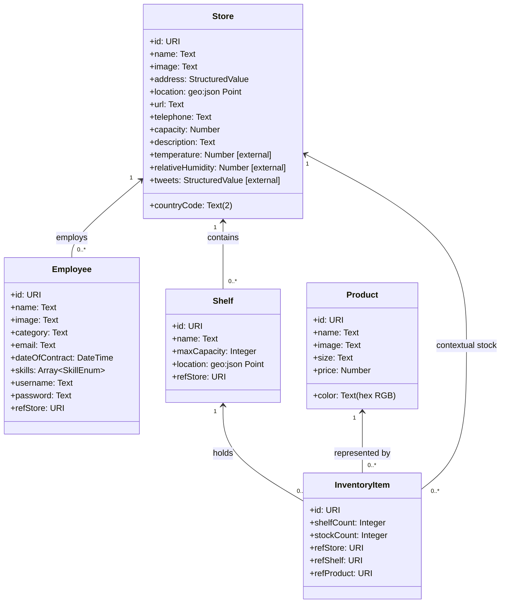

# Data Model (Final)

This document reflects the final model implemented in the app and matches the Mermaid class diagram rendered in the Home view.

## 1. Canonical Mermaid classDiagram (Exact Home View Definition)

## 2. Relationship Notes

1. One Store employs zero or more Employees.
2. One Store contains zero or more Shelves.
3. One Shelf holds zero or more InventoryItems.
4. One Product can be represented by zero or more InventoryItems.
5. InventoryItems include a Store reference for contextual stock grouping.

## 3. External Context Attributes

The following Store attributes are externally provided through Orion context provider registrations:
- `temperature`
- `relativeHumidity`
- `tweets`

## 4. Shelf Operations

**Shelf CRUD Operations:**
- **Create:** POST /api/shelves with name, maxCapacity, refStore
- **Read:** GET /api/shelves or GET /api/shelves/{shelf_id}
- **Update:** PATCH /api/shelves/{shelf_id} with new name and/or maxCapacity values
- **Delete:** DELETE /api/shelves/{shelf_id}

The Update (PATCH) operation supports editing shelf name and maximum capacity, enabling users to maintain shelf configuration directly from the Store Detail view.

## 5. Final Sync Statement

This file is synchronized with the exact Mermaid definition currently rendered in the Home view of the frontend and reflects all implemented CRUD operations including shelf updates (PR #55).

## 6. Runtime Note

The frontend networking fix for Docker deployment only changes how the UI reaches the backend and Socket.IO endpoint. It does not alter the entity schema, attributes, or relationships defined above.

The frontend parser repair in frontend/app.js also does not change this schema; it only restores valid JavaScript execution for the existing views.