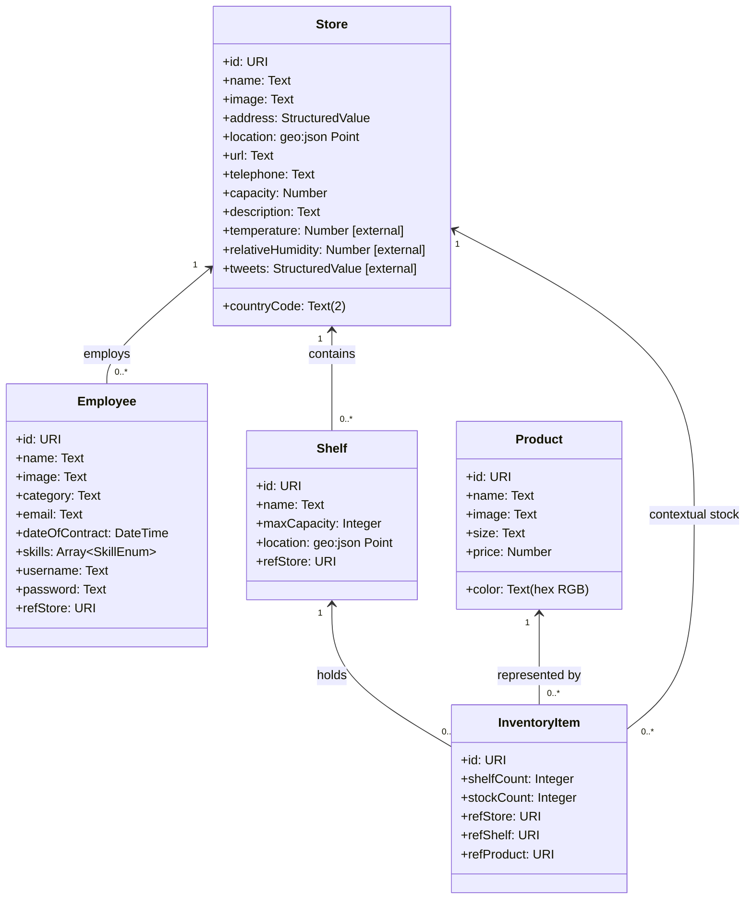

# Data Model Specification

## 1. Scope and Modeling Approach

This document defines the extended NGSIv2 entity model for the FIWARE enhanced application.

Entities in scope:
- Store
- Employee
- Product
- Shelf
- InventoryItem

The model includes assignment-mandated attributes and relationships, while preserving core operational attributes required by list/detail views and inventory workflows.

## 2. Entity Definitions

## 2.1 Store

### Purpose
Represents a physical store/warehouse where products are stored and sold.

### Attributes
Mandatory extension attributes from assignment:
- url: Text (store website URL)
- telephone: Text
- countryCode: Text (exactly 2 characters)
- capacity: Number (cubic meters)
- description: Text (long-form)
- temperature: Number (provided by external context provider)
- relativeHumidity: Number (provided by external context provider)
- tweets: StructuredValue (provided by external context provider)

Operational/base attributes needed by required views:
- name: Text
- image: Text (image URL/path)
- address: StructuredValue (postal address)
- location: geo:json Point (latitude/longitude)

Stores Map usage notes (Issue 8):
- `location` is required to place Store markers on the Leaflet map.
- `image` is used as marker visual content and hover-card image.
- `countryCode`, `temperature`, and `relativeHumidity` are rendered in the map hover card.

Issue 1B backend CRUD fields for Store:
- name
- image
- address
- location
- url
- telephone
- countryCode
- capacity
- description

## 2.2 Employee

### Purpose
Represents an employee assigned to exactly one Store.

### Attributes
Mandatory extension attributes from assignment:
- email: Text (email format)
- dateOfContract: DateTime
- skills: Array<Text> constrained to:
  - MachineryDriving
  - WritingReports
  - CustomerRelationships
- username: Text
- password: Text

Operational/base attributes needed by required views:
- name: Text
- image: Text (photo URL/path)
- category: Text (used for iconized display)

Relationship attribute:
- refStore: Relationship -> Store (exactly one Store per Employee)

## 2.3 Product

### Purpose
Represents a product type stored on shelves and sold from inventory.

### Attributes
Mandatory extension attribute from assignment:
- color: Text (RGB hexadecimal format, for example #FFAA00)

Operational/base attributes needed by required views and subscriptions:
- name: Text
- image: Text (image URL/path)
- size: Text
- price: Number

Subscription trigger note:
- `price` is monitored by the Orion subscription that detects Product price changes.

### Product Trigger Behavior
- Attribute: `price`
- Trigger: any `price` change triggers notification generation.

Issue 1B backend CRUD fields for Product:
- name
- image
- size
- price
- color

## 2.6 Issue 1B Validation and ID Policy (Implemented)

For Product and Store in Issue 1B:
- Validation scope is minimal: required field presence only.
- No advanced validation is applied in this phase (format, enums, relationships are deferred).

Entity ID strategy in create operations:
- Use payload `id` when provided.
- Otherwise generate a UUID.
- The resulting `id` is included in the NGSI entity sent to Orion.

## 2.4 Shelf

### Purpose
Represents a shelf inside a Store with finite capacity.

### Attributes
- name: Text
- maxCapacity: Integer (maximum units shelf can hold)
- location: geo:json Point (optional positional metadata inside/outside store context)

Relationship attribute:
- refStore: Relationship -> Store (each Shelf belongs to one Store)

Derived/visual value used in UI:
- fillLevelPercent: Computed value for progress bar coloring (derived from shelf inventory totals vs maxCapacity)

## 2.5 InventoryItem

### Purpose
Represents product inventory counts at Store/Shelf granularity.

### Attributes
- shelfCount: Integer (units of the Product in one specific Shelf)
- stockCount: Integer (total units of the same Product in the Store)

Subscription trigger note:
- `stockCount` is monitored by the Orion low-stock subscription and triggers alerts when it falls below the configured threshold.

### InventoryItem Trigger Behavior
- Attribute: `stockCount`
- Trigger: `stockCount < 5` triggers low-stock alert notification.

Relationship attributes:
- refProduct: Relationship -> Product
- refShelf: Relationship -> Shelf
- refStore: Relationship -> Store

Operational rule:
- Buy-one-unit operation decrements shelfCount and stockCount by 1 through backend endpoint `PATCH /api/inventory-items/<id>/buy`, which forwards Orion atomic increment payload (`$inc: -1`) on both attributes in the same PATCH.
- Product-detail add-to-shelf operation creates a new InventoryItem with initial values `shelfCount=1` and `stockCount=1`.

## 3. Relationship Model

Mandatory relationship chain:
1. Employee -> Store
   - Cardinality: many Employees to one Store.
   - Constraint: each Employee works in one and only one Store.

2. Store -> Shelf
   - Cardinality: one Store to many Shelves.

3. Shelf -> InventoryItem
   - Cardinality: one Shelf to many InventoryItems.

4. Product -> InventoryItem
   - Cardinality: one Product to many InventoryItems.

Additional contextual relation used in data access:
- InventoryItem -> Store (denormalized access path for grouped queries by Store).

## 4. Business Constraints

1. countryCode must be exactly two characters.
2. skills must contain only allowed enum values.
3. Product color must be stored as RGB hexadecimal text.
4. Store `location` should contain valid numeric longitude and latitude values for map rendering.
5. An Employee must always reference one valid Store.
6. A Shelf must always reference one valid Store.
7. An InventoryItem must reference valid Product, Shelf, and Store entities.
8. In Product detail view, adding InventoryItem is limited to Shelves in the selected Store that do not already contain that Product.
9. In Product detail view, a newly created InventoryItem starts with `shelfCount=1` and `stockCount=1`.
10. In Store detail view, adding InventoryItem to Shelf is limited to Products not already present in that Shelf.

Issue 1C backend enforcement scope for constraints 4-6:
- Relationship validation checks only that referenced entities exist in Orion.
- Cross-entity consistency rules are not enforced in this issue.

## 5. External Context Attribution Rules

Store attributes temperature, relativeHumidity, and tweets are externally provided context attributes:
- Registered in Orion at application startup.
- Resolved from tutorial external context providers.
- Treated as standard Store attributes at query/render time.
- `tweets` shall be modeled as `StructuredValue` to preserve provider payload structure.

Seed initialization requirements for Store placeholders:
- `temperature` must be initialized using explicit NGSIv2 shape: `{"type": "Float", "value": 21.0}`
- `relativeHumidity` must be initialized using explicit NGSIv2 shape: `{"type": "Float", "value": 0.68}`
- `tweets` must be initialized using explicit NGSIv2 shape: `{"type": "StructuredValue", "value": []}`

Startup registration split:
- Registration A: `Store.temperature`, `Store.relativeHumidity`
- Registration B: `Store.tweets`
- Both registrations use provider URL `http://tutorial:3000/api/v2` with `legacyForwarding=true`.

## 5.1 Subscription Trigger Implementation Clarification

Trigger behavior for `Product.price` and `InventoryItem.stockCount` is implemented through Orion subscriptions.
These trigger conditions are not hardcoded as entity-state business rules in backend CRUD logic.
The backend receives Orion callback payloads and forwards notifications in real time.

## 6. NGSIv2-Oriented Attribute Typing Guidance

Recommended NGSIv2 attribute typing:
- Text-like values: type Text
- Numeric counts/capacity/metrics: type Integer or Number as appropriate
- Dates: type DateTime
- Enumerated lists: type StructuredValue or Array representation
- tweets payload: type StructuredValue
- Geospatial coordinates: type geo:json
- Entity references: Relationship-style URI fields (for NGSIv2 often represented as Text URI fields with ref naming convention)

## 7. Mermaid UML Entity Diagram

The Mermaid UML diagram defined below is rendered in the Home view of the application.

## 8. View Traceability Matrix

- Products list view requires: Product.image, Product.name, Product.color, Product.size.
- Stores list view requires: Store.image, Store.name, Store.countryCode, Store.temperature, Store.relativeHumidity.
- Employees list view requires: Employee.image, Employee.name, Employee.category, Employee.skills.
- Product detail grouping requires: InventoryItem.stockCount by Store and InventoryItem.shelfCount by Shelf.
- Product detail add-to-shelf selector requires: Shelf.refStore filtering and exclusion of Shelves already linked by (InventoryItem.refStore, InventoryItem.refProduct, InventoryItem.refShelf).
- Store detail grouped table requires: Shelf.name, Shelf.maxCapacity, Product(image/name/price/size/color), InventoryItem.stockCount, InventoryItem.shelfCount.
- Store detail weather block requires: Store.temperature and Store.relativeHumidity.
- Store detail tweets block requires: Store.tweets.
- Store map/detail requires: Store.location and Store.image.

## 9. Data Initialization Targets (Assignment-Aligned)

Initial load script must include at least:
- 4 Employees
- 4 Stores
- 4 Shelves per Store
- 10 Products
- Enough InventoryItems to guarantee at least 4 Products per Shelf

This initialization baseline ensures all mandatory UI views and grouping behavior.

## 10. Implementation Status

### 10.1 Implemented

- All five entities are implemented in backend CRUD routes and services:
  - Product
  - Store
  - Employee
  - Shelf
  - InventoryItem
- Validation is implemented for required fields, formats, numeric constraints, and reference existence.
- Orion subscriptions are implemented for Product price changes and low stock alerts.
- Backend notification reception and logging are implemented.
- Frontend renders Store detail grouped by Shelf and InventoryItem using this model.
- Frontend renders a lazy-loaded Three.js Store tour using existing Store, Shelf, Product, and InventoryItem fields; no entity schema changes are required.
- Purchase flow uses backend atomic buy endpoint (`/api/inventory-items/<id>/buy`) that forwards Orion raw `$inc` payload for `shelfCount` and `stockCount`.
- Frontend Home view renders this Mermaid class diagram with all entity attributes and relationship multiplicities.

### 10.2 Pending

- Advanced visualization layers (Store map interactions) do not alter this entity model and remain outside current implemented UI scope.

## 10.3 Issue 4 UX Alignment (Non-Entity State)

Issue 4 introduced global frontend UX behavior that does not modify NGSI entity schemas but affects UI-level state representation:

- Theme state:
  - Persisted in browser `localStorage`.
  - Applied via `html[data-theme="dark"]` and CSS custom property overrides.
- Language state:
  - Persisted in browser `localStorage`.
  - Applied through EN/ES translation keys mapped to DOM nodes using `data-i18n` attributes.
- Navigation model at UI layer:
  - Global sticky navbar with 5 sections: Home, Products, Stores, Employees, Stores Map.
  - Stores Map is currently a placeholder section; no new entity relationships were added.
- Known exception for validation integrity:
  - Existing HTML form tags were intentionally retained so native HTML5 validation attributes and constraints remain authoritative.

## 11. Project-Structure Alignment Note (Issue #16)

This issue introduces no data-model/entity-schema changes.

Current implemented state alignment:

- Repository now includes root `AGENTS.md` and root `README.md` to standardize workflow and operational usage.
- `docker-compose.yml` now includes application runtime services (`backend`, `frontend`) in addition to FIWARE infrastructure.
- Environment and ignore baselines were aligned at repository root (`.env`, `.gitignore`).

Entity definitions, attributes, relationships, and constraints in this document remain unchanged by this issue.